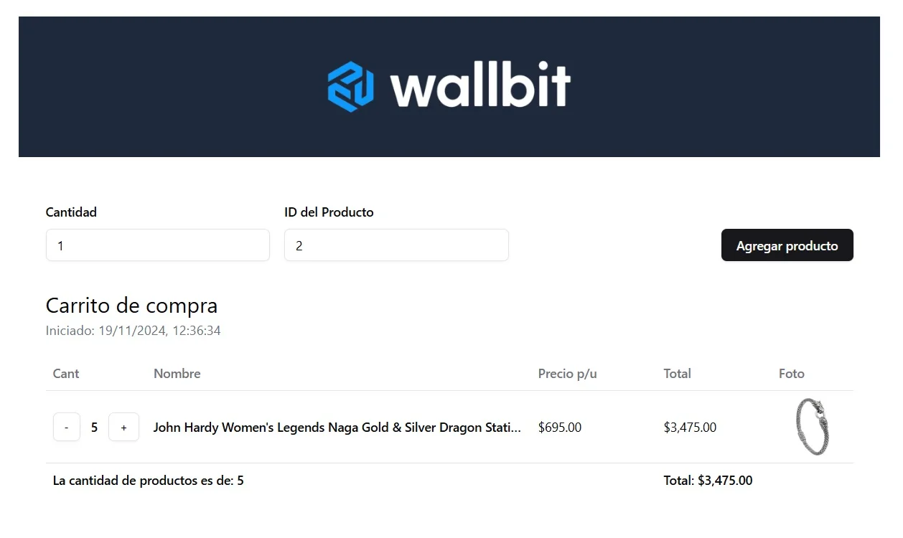
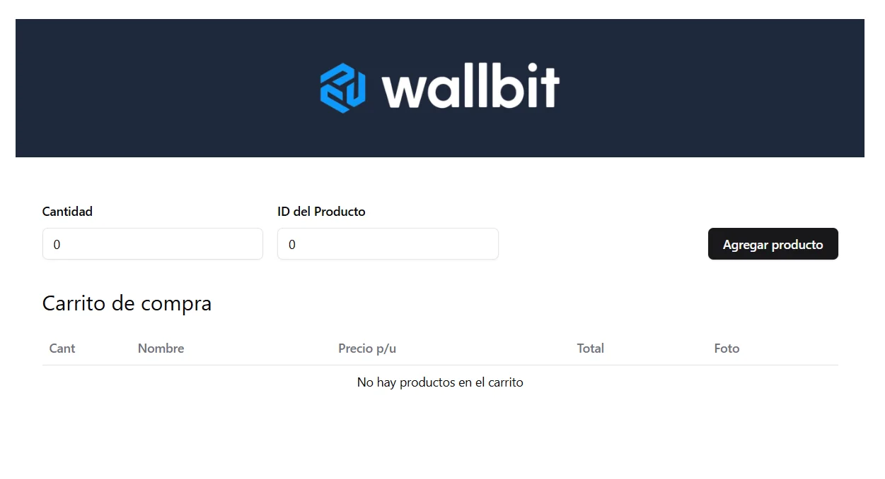

# Wallbit Junior Frontend Challenge
<div align="center">

<br>

</div>

## 📝 Descripción
Este repositorio tiene como objetivo resolver el desafío de Wallbit para el puesto de Junior Frontend presentado en el [stream](https://www.twitch.tv/goncypozzo) de Gonzalo "Goncy" Pozzo. 

## 🚀 Features
### Requeridos
- Agregar productos al carrito de compras por ID y cantidad.
- Mostrar productos agregados en una tabla.
    - Cantidad
    - Nombre del producto
    - Precio unitario
    - Precio total
    - Imagen
- Manejar errores que devuelve la API o cualquier interacción con el formulario por parte del usuario.

### Extras
- Mostrar el cantidad total de productos agregados.
- Mostrar el costo total del carrito.
- Mostrar la fecha de creación del carrito.
    - La fecha de creacion es la fecha en la que se crea el carrito (se agrega el primer producto).
    - La fecha se elimina al eliminar todos los productos del carrito
    - La fecha se mantiene al recargar la página
- El carrito tiene persistencia en LocalStorage, por lo que si refrescamos la página, los productos y su fecha de creación se mantienen.

### Bonus
- Controles para cambiar la cantidad de productos desde el carrito.
    - El usuario puede aumentar o disminuir la cantidad del producto, si este llega a cero, el producto es eliminado del carrito.
- Se agregaron validaciones al formulario para que el usuario no pueda agregar productos con cantidades negativas o cero. Como asi tampoco tipos de datos incorrectos.
- Accesibilidad por teclado, todos los componentes son accesibles por teclado.
- Skeleton de carga mientras se obtienen los productos de la API.
- UI con estilos limpios y minimalistas.


## 🛠 Tecnologías utilizadas 
- React
- TypeScript
- Tailwind CSS
- Shadcn/UI Components
- React Hook Form
- Zod Validation
- LocalStorage API

## 📋 Prerequisitos para la instalación
- Node.js (v18 or later)
- pnpm

## 🔧 Instalación

1. Clonar el repositorio
```bash
git clone https://github.com/LeanMendez/wallbit-challenge.git
cd wallbit-challenge
```

2. Instalar las dependencias del proyecto con pnpm
```bash
pnpm install
```

4. Correr el servidor de desarrollo
```bash
pnpm run dev
```

## 📦 Estructura básica del proyecto
```
src/
├── components/
│   ├── Cart/
│   ├── AddProduct/
│   └── ui/
├── hooks/
├── lib/
└── App.tsx
```


## 📞 Contacto
- Leandro Méndez - leandroa.mendez@gmail.com
- Link del repositorio: https://github.com/LeanMendez/wallbit-challenge.git
- Link a la demo: https://wallbit-challenge-lean-mendez.vercel.app/